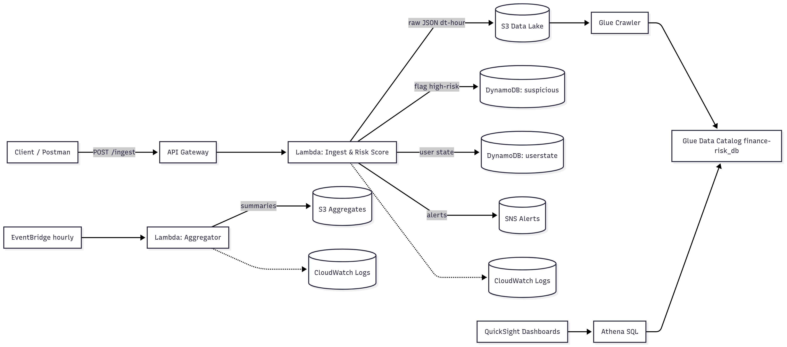

# Financial Transaction Risk Analyzer (AWS Serverless)

Real-time pipeline that ingests card transactions, scores risk with explainable rules, and alerts on suspicious activity. Raw events land in S3 for Glue/Athena analytics; flagged cases go to DynamoDB. CI/CD via GitHub Actions.



## (step-by-step)

### 1) Prerequisites

- AWS account with permissions for Lambda, API Gateway, DynamoDB, S3, SNS, EventBridge, Glue, Athena
- **AWS CLI v2**, **SAM CLI**, **Python 3.11**, **Git**
- Set region (adjust if needed):
```bash
aws configure set region ap-southeast-2
aws sts get-caller-identity
```

### 2) Clone the repo

```bash
git clone https://github.com/<your-username>/finance-risk-analyzer.git
cd finance-risk-analyzer
```

### 3) Build & deploy (SAM)

```bash
sam build
sam deploy --guided \
  --stack-name finance-risk \
  --parameter-overrides \
    ProjectName=finance-risk \
    HomeCountry=AU \
    HighAmountThreshold=1000 \
    ForeignAmountThreshold=500 \
    HighRiskThreshold=0.85
```

Note the Outputs: ApiUrl, AlertsTopicArn, DataLakeBucketName, GlueDatabaseName.
Fetch them anytime:

```bash
STACK=finance-risk
API=$(aws cloudformation describe-stacks --stack-name $STACK --query "Stacks[0].Outputs[?OutputKey=='ApiUrl'].OutputValue" --output text)
TOPIC=$(aws cloudformation describe-stacks --stack-name $STACK --query "Stacks[0].Outputs[?OutputKey=='AlertsTopicArn'].OutputValue" --output text)
BUCKET=$(aws cloudformation describe-stacks --stack-name $STACK --query "Stacks[0].Outputs[?OutputKey=='DataLakeBucketName'].OutputValue" --output text)
DB=$(aws cloudformation describe-stacks --stack-name $STACK --query "Stacks[0].Outputs[?OutputKey=='GlueDatabaseName'].OutputValue" --output text)
echo -e "API=$API\nTOPIC=$TOPIC\nBUCKET=$BUCKET\nDB=$DB"
```

### 4) Subscribe to alerts (confirm the email)
```bash
aws sns subscribe --topic-arn "$TOPIC" --protocol email --notification-endpoint you@example.com
```

### 5) Send test transactions
High-risk (should alert):

```bash
curl -s -X POST "$API" -H 'Content-Type: application/json' -d '{
  "user_id":"U123","amount":1200,"currency":"AUD","merchant":"Electronics World",
  "mcc":"5732","channel":"ecomm","country":"US","city":"San Francisco","device_id":"dev-abc-123"
}' | jq
```
Low-risk (no alert):

```bash
curl -s -X POST "$API" -H 'Content-Type: application/json' -d '{
  "user_id":"U1","amount":20,"currency":"AUD","merchant":"Coffee Bar",
  "channel":"pos","country":"AU","city":"Melbourne","device_id":"dev-1"
}' | jq
```

### 6) Verify data
```bash
aws s3 ls "s3://$BUCKET/transactions/raw/" --recursive | head   # raw S3 events
aws dynamodb scan --table-name finance-risk-suspicious --max-items 5          # high-risk flags
```

### 7) Analytics (Glue + Athena)
```bash
aws glue start-crawler --name finance-risk-crawler
```

In Athena (same region):
```bash
MSCK REPAIR TABLE "finance-risk_db"."raw";

SELECT dt, hour, COUNT(*) AS n
FROM "finance-risk_db"."raw"
GROUP BY dt, hour
ORDER BY dt DESC, hour DESC
LIMIT 20;

SELECT r AS rule, COUNT(*) AS hits
FROM "finance-risk_db"."raw"
CROSS JOIN UNNEST(rules) AS t(r)
GROUP BY r
ORDER BY hits DESC;
```
### 8 ) Logs / troubleshooting
```bash
sam logs -n IngestFunction --stack-name finance-risk --tail
```

### 9) (Optional) Run locally (no AWS costs)
```bash
sam local start-api   # -> http://127.0.0.1:3000/ingest
```


### 10) Clean up (avoid charges)
```bash 
aws s3 rm "s3://$BUCKET" --recursive
sam delete --stack-name finance-risk
aws logs delete-log-group --log-group-name /aws/lambda/finance-risk-ingest 2>/dev/null || true
aws logs delete-log-group --log-group-name /aws/lambda/finance-risk-aggregate 2>/dev/null || true
```


